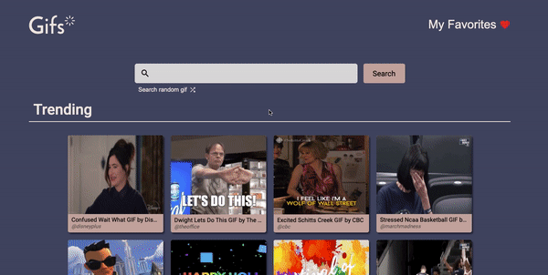
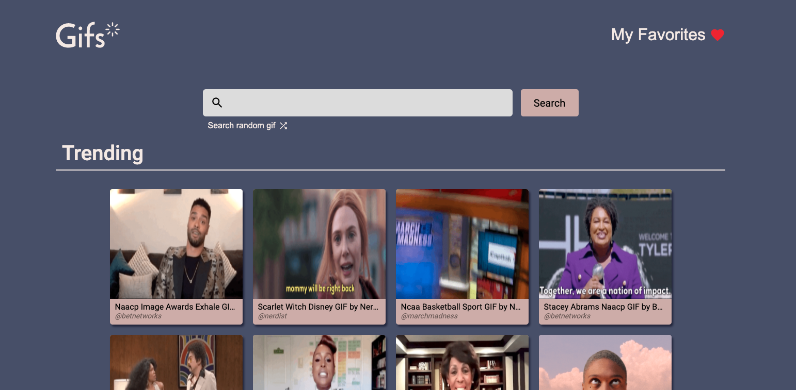
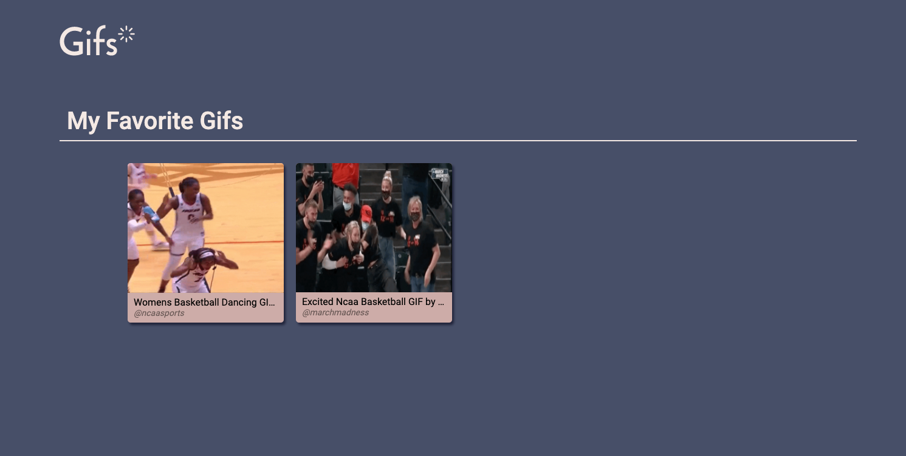

# Search gifs
<h1 align="center"></h1>

<p align="center">An application to search gifs on the web.</p>

<p align="center">
    
</p>

## Getting Started

### Installing dependencies
```
yarn
```

### External APIs
This application uses the [Giphy](https://developers.giphy.com/docs/api/#quick-start-guide) API to fetch the gifs. To properly run the application you must follow the steps below:

- Create a `.env` file in the same directory of `.env.example`
- Copy the content inside `.env.example` in the `.env` file
- Create a Giphy account in order to generate an API key
- Paste your key in the `REACT_APP_GIPHY_API_KEY` property in the `.env` file:
```
REACT_APP_GIPHY_API_KEY=<YOUR_KEY>
```

### Running application
```
yarn start
```

### Running tests
```
yarn test
```

## Screenshots
<p align="center">
    
    
</p>

## Built With

* [ReactJs](https://reactjs.org/)
* [Yarn](https://yarnpkg.com/)
* [TypeScript](https://www.typescriptlang.org/)
* [Axios](https://github.com/axios/axios)
* [Styled Components](https://styled-components.com/)

## Author
* **Tatiana Lopes** - [@tatianalopes](https://github.com/tatianalopes)

<div align="center">Uses icons made by <a href="https://www.freepik.com" title="Freepik">Freepik</a> from <a href="https://www.flaticon.com/" title="Flaticon">www.flaticon.com</a></div>